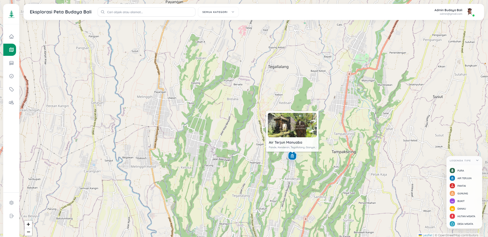
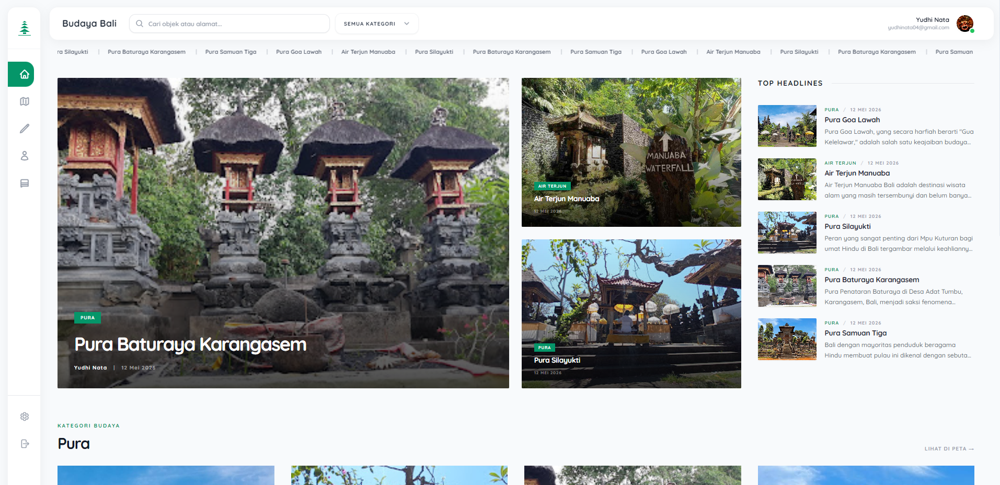
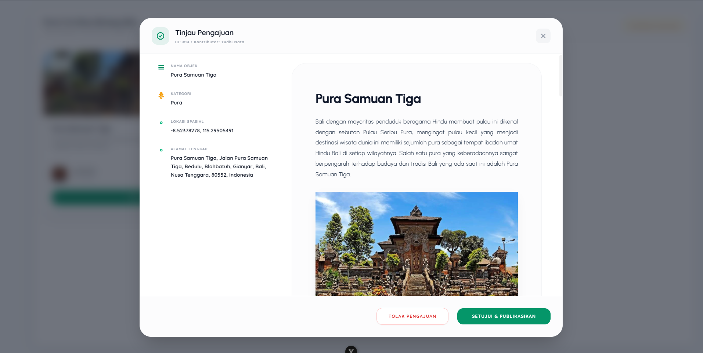
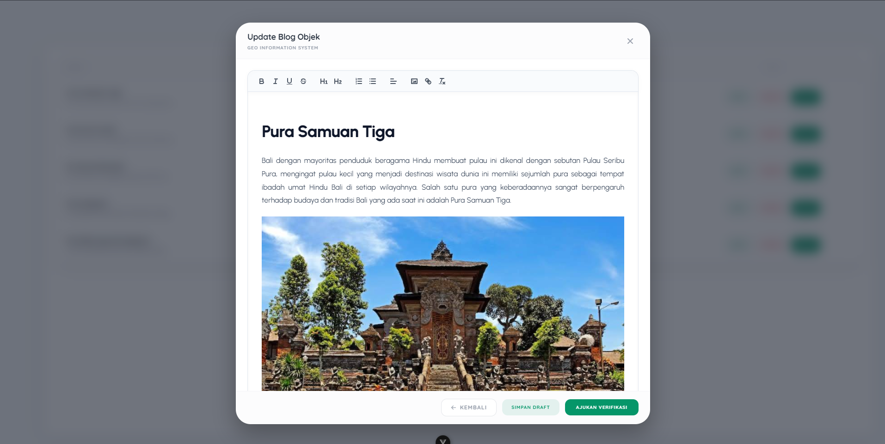

# Sistem Informasi Geografis Pemetaan Budaya Bali

## Deskripsi Sistem

Sistem Informasi Geografis (SIG) Pemetaan Budaya Bali adalah sebuah platform berbasis web yang dikembangkan untuk mengelola, memvisualisasikan, dan mendokumentasikan sebaran data geospasial warisan budaya di wilayah Bali. Sistem ini dirancang untuk menjembatani kebutuhan inventarisasi data kebudayaan dengan teknologi pemetaan digital modern, memfasilitasi pelestarian informasi, dan menyediakan referensi tata ruang budaya yang akurat untuk kepentingan akademis, pariwisata, dan pelestarian sejarah.

## Arsitektur Teknologi

Sistem ini dibangun dengan arsitektur client-server terpisah (decoupled architecture) dengan tumpukan teknologi berikut:

1. **Frontend (Antarmuka Pengguna)**
   * **Kerangka Kerja**: Vue.js (Composition API).
   * **Manajemen State**: Pinia.
   * **Penataan Gaya**: Tailwind CSS untuk implementasi desain antarmuka yang responsif dan konsisten.
   * **Integrasi Peta**: Leaflet.js untuk manipulasi visualisasi peta interaktif.

2. **Backend (Layanan API)**
   * **Bahasa Pemrograman**: Go (Golang), dipilih karena kinerja dan efisiensi konkurensinya.
   * **Struktur Direktori**: Mengadopsi pemisahan lapisan (layered architecture) yang terdiri dari Handler, Service, dan Repository.
   * **Manajemen Basis Data**: Penggunaan pustaka `pgxpool` untuk optimalisasi koneksi.

3. **Basis Data**
   * **Sistem Manajemen Relasional**: PostgreSQL.
   * **Ekstensi Spasial**: PostGIS untuk memfasilitasi penyimpanan, kueri, dan analisis data berdimensi geospasial.

## Fungsionalitas Utama

* **Visualisasi Pemetaan Dinamis**: Render titik-titik koordinat budaya secara dinamis di atas lapisan peta dasar, dilengkapi dengan fitur penyaringan spesifik berdasarkan tipologi budaya.
* **Sistem Partisipasi Kontributor**: Mekanisme pendaftaran data partisipatif di mana pengguna yang memiliki hak akses kontributor dapat mengusulkan titik lokasi baru dan melampirkan dokumentasi pendukung.
* **Alur Kerja Verifikasi Data (Data Governance)**: Implementasi sistem peninjauan di mana administrator memiliki otoritas untuk memverifikasi, mengedit, atau menolak usulan data dari kontributor sebelum data tersebut disajikan pada peta publik. Hal ini memastikan integritas dan akurasi informasi yang dipublikasikan.
* **Modul Publikasi Artikel terintegrasi**: Manajemen konten mendetail untuk setiap titik koordinat, memungkinkan penyajian informasi historis dan kultural dalam format artikel komprehensif.

## Visualisasi Antarmuka

## Prosedur Instalasi dan Konfigurasi Lokal

### Prasyarat Instalasi

Sistem operasi target harus telah terpasang perangkat lunak berikut:

* Go Compiler (Versi 1.20+)
* Node.js Runtime (Versi 18+)
* PostgreSQL Database Server (dilengkapi dengan modul PostGIS)

### Panduan Implementasi

1. **Inisialisasi Repositori**
   Unduh keseluruhan kode sumber aplikasi dari repositori ke dalam penyimpanan lokal.

2. **Konfigurasi Variabel Lingkungan**
   * Masuk ke direktori `backend` dan `frontend`.
   * Duplikasi berkas pengaturan `.env.example` menjadi `.env`.
   * Sesuaikan parameter koneksi basis data, kunci enkripsi otentikasi, dan rute API sesuai dengan topologi jaringan lokal.

3. **Eksekusi Layanan Backend**
   * Akses direktori `backend`.
   * Lakukan instalasi dependensi pustaka Go.
   * Kompilasi dan jalankan modul utama server REST API.

4. **Eksekusi Layanan Frontend**
   * Akses direktori `frontend`.
   * Lakukan instalasi dependensi menggunakan pengelola paket NPM.
   * Jalankan server pengembangan untuk memuat antarmuka pengguna pada peramban web.
